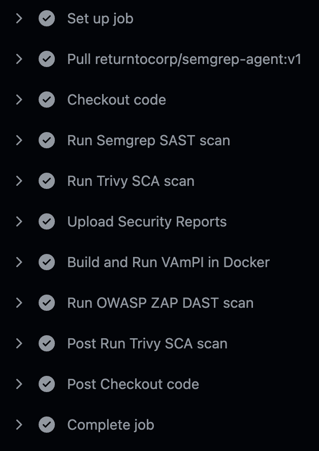
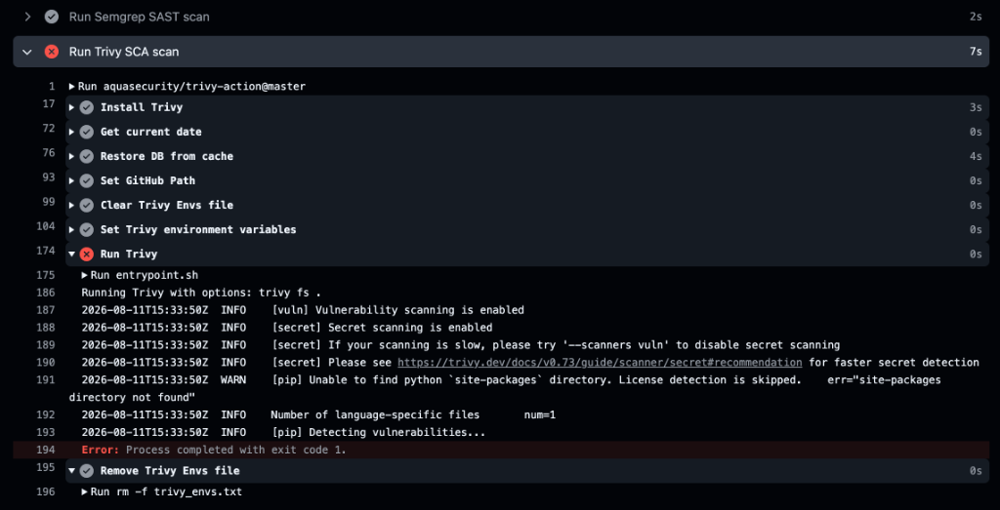
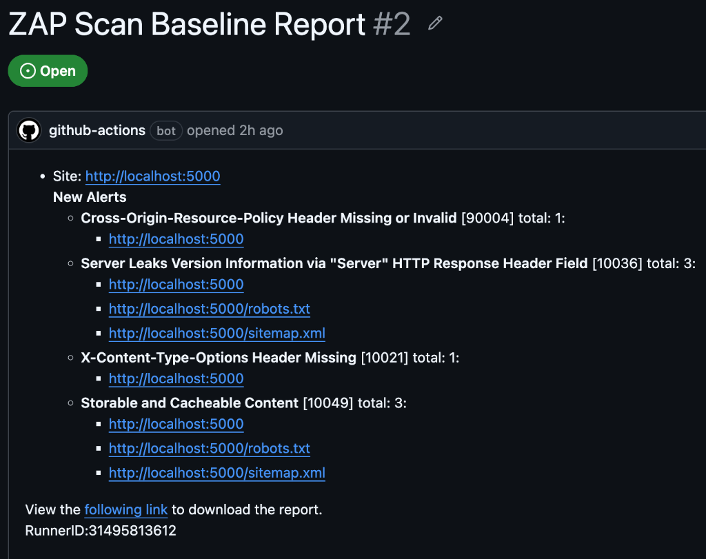

[English](README.en.md) | [Русский](README.md)

---

# Vault Gate CI: DevSecOps Pipeline

A GitHub Actions pipeline for automating security controls within the CI/CD lifecycle (SDLC). A vulnerable REST API microservice (VAmPI) serves as the test target.

## Pipeline Architecture

The pipeline is triggered on every push to the `main` branch and executes three security layers:

1. **SAST (Static Application Security Testing)**
   * **Tool:** Semgrep
   * **Task:** Detect hardcoded secrets, logic flaws, and insecure Python (FastAPI) code prior to the build phase.

2. **SCA (Software Composition Analysis)**
   * **Tool:** Trivy
   * **Task:** Identify CVEs in third-party dependencies. A Security Gate is enforced: the build is blocked if `HIGH` or `CRITICAL` vulnerabilities are detected. Reports are exported as GitHub artifacts.

3. **DAST (Dynamic Application Security Testing)**
   * **Tool:** Docker & OWASP ZAP (Baseline Scan)
   * **Task:** Build and run the API in a container. The scanner attacks the running application (`http://localhost:5000`) to detect runtime misconfigurations (e.g., missing security headers). Findings are automatically converted into developer Issues.

## Execution Results & Triage

### 1. Checks Orchestration
End-to-end process: static code analysis, dependency scanning, container build, and dynamic testing of the live service.

### 2. Vulnerability Blocking (Security Gate)
Pipeline interruption (exit-code 1) upon detecting critical vulnerabilities in project dependencies. Vulnerable code is prevented from passing the build stage.

### 3. Bug Tracker Integration
OWASP ZAP automatically creates GitHub Issues for the development team based on identified runtime vulnerabilities.

### Key Vulnerabilities & Mitigation
* **Dependencies (SCA):** Identified Python packages with High CVEs. *Mitigation:* Pinning patched library versions in `requirements.txt`.
* **Runtime (DAST):** Missing Anti-CSRF tokens and CSP headers. *Mitigation:* Enforcing strict HTTP security headers and CORS policies via FastAPI middleware.

## Configuration
The pipeline infrastructure (IaC) is defined in `.github/workflows/sec-pipeline.yml`.